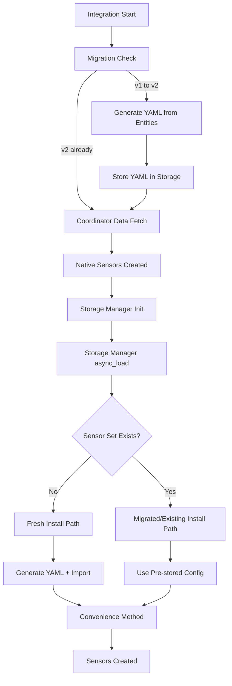

# Synthetic Sensor Startup Sequence

This document explains the critical startup sequence for synthetic sensors in the SPAN Panel integration, highlighting the key differences between fresh
installations and existing installations.

## Overview

The SPAN Panel integration uses the `ha-synthetic-sensors` library to create formula-based sensors that extend circuit and panel data. The startup sequence has
a crucial "fork in the road" that determines whether sensor configurations are generated from scratch or loaded from existing storage.

**Important**: With the Version 2 migration strategy, the concept of "existing installations" has changed. After migration, all installations become "existing"
from the storage perspective, with YAML configurations pre-generated during the migration process.

## High-Level Flow



## Detailed Startup Sequence

### Phase 0: Migration (Version 1 to Version 2 Only)

#### 0. Migration Check (`__init__.py` - `async_migrate_entry`)

```python
if config_entry.version < 2:
    # Analyze existing entities for this config entry
    entity_registry = er.async_get(hass)
    entities = er.async_entries_for_config_entry(entity_registry, config_entry.entry_id)

    # Generate YAML from existing entities and store in ha-synthetic-sensors storage
    await migrate_config_entry_to_synthetic_sensors(hass, config_entry)

    config_entry.version = 2
```

**Result**: For v1 installations, YAML configurations are pre-generated and stored before normal setup begins.

### Phase 1: Core Initialization (Common to Both Paths)

#### 1. Integration Setup (`__init__.py`)

```python
coordinator = SpanPanelCoordinator(hass, span_panel, entry)
await coordinator.async_config_entry_first_refresh()
```

**Result**: Coordinator has live SPAN panel data

#### 2. Native Sensor Creation (`sensor.py`)

```python
entities = [SpanPanelPanelStatus, SpanUnmappedCircuitSensor, ...]
async_add_entities(entities)
```

**Result**: Native HA sensors created first

#### 3. Storage Manager Initialization (`synthetic_sensors.py`)

```python
self.storage_manager = StorageManager(self.hass, f"{DOMAIN}_synthetic")
await self.storage_manager.async_load()
```

**Critical**: `async_load()` loads ALL existing sensor sets from persistent storage. After this call:

- **Fresh Install**: Storage manager is empty (new installations only)
- **Migrated Install**: Storage manager contains sensor configurations generated during migration
- **Existing v2 Install**: Storage manager contains all previously saved sensor configurations

### Phase 2: The Fork in the Road

#### 4. Sensor Configuration Generation (Always Done)

```python
# Generate sensor configs and mappings - ALWAYS NEEDED
panel_sensor_configs, panel_backing_entities, global_settings, panel_mappings = \
    await generate_panel_sensors(coordinator, span_panel, device_name)

# Build sensor-to-backing mapping - ALWAYS NEEDED for data provider
all_mappings = {}
all_mappings.update(panel_mappings)
all_mappings.update(circuit_mappings)
```

**Important**: Configuration generation happens in both cases because:

- Data provider needs backing entity metadata
- Convenience method needs sensor-to-backing mapping
- Only the YAML import step differs

#### 5. The Critical Check

```python
device_identifier = span_panel.status.serial_number
sensor_set_id = f"{device_identifier}_sensors"

if not self.storage_manager.sensor_set_exists(sensor_set_id):
    # FRESH INSTALL PATH
else:
    # EXISTING INSTALL PATH
```

### Fresh Installation Path

#### 6a. Fresh Install: Create and Import

```python
_LOGGER.info("Fresh installation detected - creating sensor set and importing default configuration")

# Create new sensor set
await self.storage_manager.async_create_sensor_set(
    sensor_set_id=sensor_set_id,
    device_identifier=device_identifier,
    name=f"SPAN Panel {device_identifier}",
)

# Generate and import initial YAML configuration
yaml_content = await _construct_complete_yaml_config(all_sensor_configs, global_settings)
await self.storage_manager.async_from_yaml(
    yaml_content=yaml_content,
    sensor_set_id=sensor_set_id,
    device_identifier=device_identifier,
)
```

**Result**: Storage manager now contains newly created sensor set with default configurations

### Existing/Migrated Installation Path

#### 6b. Existing/Migrated Install: Use Stored Configuration

```python
_LOGGER.debug("Existing sensor set found - using stored configuration (no YAML generation needed)")
# DO NOTHING - sensor set already loaded from disk during async_load()
```

**Result**: Storage manager already contains the sensor set loaded from persistent storage (either from previous v2 installations or generated during v1→v2
migration)

### Phase 3: Convenience Method Processing (Common Path Resumes)

#### 7. Backing Entity Registration

```python
sensor_manager = await async_setup_synthetic_sensors_with_entities(
    storage_manager=storage_manager,  # Contains configs from either path
    sensor_to_backing_mapping=sensor_to_backing_mapping,  # Always generated
    data_provider_callback=data_provider,  # Always created
)
```

#### 8. What the Convenience Method Does

```python
# Extract backing entity IDs from mapping
backing_entity_ids = set(sensor_to_backing_mapping.values())

# Register backing entities with sensor manager
sensor_manager.register_data_provider_entities(backing_entity_ids)

# Load configuration from storage manager
config = storage_manager.to_config(device_identifier=device_identifier)
await sensor_manager.load_configuration(config)
```

**Key Insight**: The convenience method is **agnostic** to fresh vs existing installation. It just:

1. Registers backing entities from the provided mapping
2. Loads whatever sensor configurations are in the storage manager
3. Creates sensors based on those configurations

## Performance Implications

### Fresh Installation

- **Higher startup cost**: YAML generation and import
- **One-time operation**: Only happens on first setup
- **Complete configuration**: Creates all default sensors

### Migrated Installation (v1→v2)

- **Migration cost**: One-time YAML generation during migration phase
- **Fast subsequent startups**: Uses pre-generated YAML from migration
- **Preserves identifiers**: All entity IDs and unique IDs preserved from v1
- **Transparent operation**: Appears identical to fresh v2 installation after migration

### Existing v2 Installation

- **Fast startup**: Skips expensive YAML generation
- **Uses cached config**: Loads from persistent storage
- **Preserves customizations**: User modifications are retained

## Key Components Always Generated

Even on existing installations, these components are always generated:

1. **Sensor-to-Backing Mapping**: Maps sensor keys to backing entity IDs
2. **Backing Entity Metadata**: Enables data provider to extract values from coordinator
3. **Data Provider Callback**: Provides live data from SPAN coordinator

## Storage Manager State Summary

| Installation Type   | Storage Manager Contents After Setup                              |
| ------------------- | ----------------------------------------------------------------- |
| Fresh Install       | Newly created sensor set + imported YAML configurations           |
| Migrated Install    | Sensor set created during migration + YAML from existing entities |
| Existing v2 Install | Existing sensor set loaded from disk                              |

All result in the same outcome: storage manager contains sensor configurations that the convenience method can load and process.

## Data Flow

### Fresh Installation

```text
Coordinator Data → Config Generation → YAML Creation → Storage Import → Convenience Method → Sensors
```

### Migrated Installation (v1→v2)

```text
Migration Phase: Entity Registry → YAML Generation → Storage Import
                                                           ↓
Runtime Phase:   Coordinator Data → Config Generation → Storage (Pre-loaded) → Convenience Method → Sensors
                                                      ↗
                                           Skip YAML Creation/Import
```

### Existing v2 Installation

```text
Coordinator Data → Config Generation → Storage (Pre-loaded) → Convenience Method → Sensors
                                   ↗
                        Skip YAML Creation/Import
```

## Troubleshooting

### Common Issues

1. **Sensor set not found**: Check if `async_load()` completed successfully
2. **Missing backing entities**: Verify sensor-to-backing mapping generation
3. **No sensor data**: Ensure coordinator has valid data before synthetic setup
4. **Configuration not loading**: Check storage manager sensor set existence

### Debug Points

- **Fresh Install Detection**: Look for "Fresh installation detected" log message
- **Existing Install Detection**: Look for "Existing sensor set found" log message
- **Backing Entity Count**: Check sensor-to-backing mapping size in logs
- **Storage Contents**: Use `storage_manager.list_sensor_sets()` to verify loaded data

## Conclusion

The startup sequence's "fork in the road" optimizes performance by:

- Generating complete configurations only when needed (fresh installs)
- Reusing stored configurations for fast restarts (existing installs)
- Always providing live data through the coordinator-backed data provider

Both paths converge at the convenience method, which creates functional synthetic sensors regardless of the configuration source.
