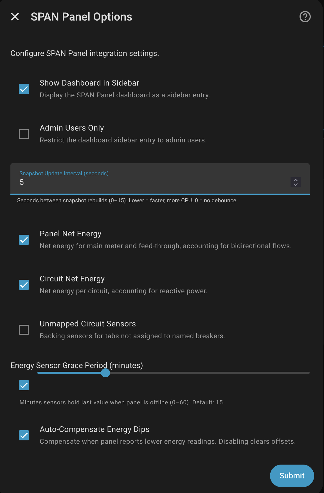
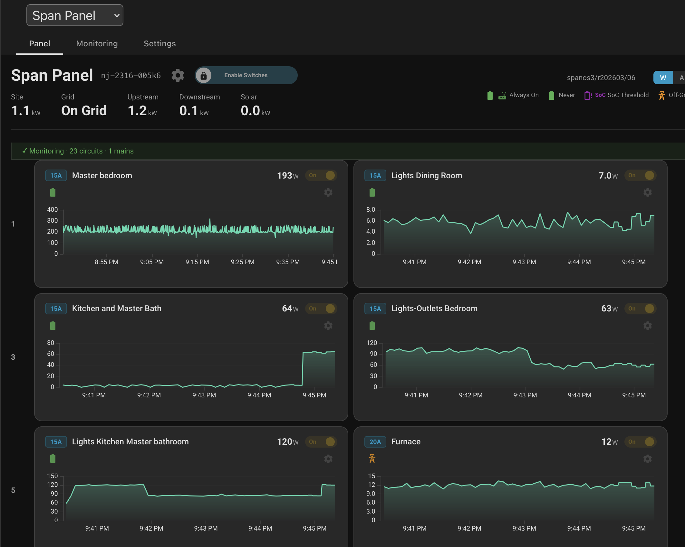
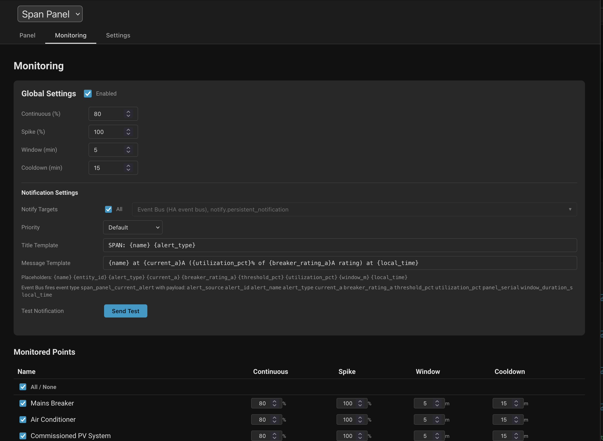

# Frontend Dashboard

The SPAN Panel integration includes a built-in frontend dashboard accessible from the Home Assistant sidebar. The dashboard provides real-time visualization of
your panel's electrical activity, circuit-level monitoring configuration, and integration settings — all without requiring a separate Lovelace card.

## Enabling the Dashboard

The dashboard is enabled via the integration's configuration options:

1. Go to `Settings` > `Devices & Services` > `SPAN Panel` > `Configure` > `General Options`
2. Check **Show Dashboard in Sidebar** to add a sidebar entry
3. Optionally check **Admin Users Only** to restrict access to administrator accounts

## Panel View

The Panel tab displays your SPAN panel layout with real-time circuit-level power graphs. Each circuit card shows:

- **Breaker rating** and **current power draw** in the card header
- **Circuit priority icons** indicating always-on, never-shed, SoC threshold, or off-grid shed behavior
- **Historical power or current graph** with configurable time horizon globally or per circuit
- **Switch control** for user-controllable circuits (via the safety slider in the card header)

The top banner summarizes panel-level metrics: site power, grid state, upstream/downstream current, and solar production. A firmware version badge and legend
for circuit priority icons are displayed alongside.

Use the **Enable Switches** toggle in the banner to globally enable or disable circuit switch controls.

## Monitoring View

The Monitoring tab provides current-based alerting for individual circuits. It detects sustained high utilization and transient spikes relative to each
circuit's breaker rating, then delivers notifications through configurable channels.

### Global Settings

- **Continuous (%)** — Sustained utilization threshold as a percentage of breaker rating. When a circuit draws more than this percentage continuously for the
  configured window duration, an alert is triggered. For example, a 15A breaker at 80% fires when the circuit sustains above 12A.
- **Spike (%)** — Instantaneous spike threshold as a percentage of breaker rating. A single reading above this level triggers an immediate alert without waiting
  for the window duration. For example, a 15A breaker at 100% fires the moment current exceeds 15A.
- **Window (min)** — How long a circuit must continuously exceed the continuous threshold before an alert fires. Short windows (e.g., 1–2 min) catch brief
  overloads; longer windows (e.g., 5–15 min) filter out transient loads like motor startup surges.
- **Cooldown (min)** — Minimum quiet period after an alert before the same circuit can trigger another alert. Prevents notification floods when a circuit
  oscillates around the threshold. For example, a 15-minute cooldown means you receive at most one alert per circuit every 15 minutes.

### Notification Settings

- **All Targets** — Select all notification targets at once
- **Notify Targets** — Individual notification targets including mobile devices, persistent notification, and the HA event bus
- **Priority** — Notification priority level (controls iOS interruption level and Android notification channel)
- **Title/Message Templates** — Customizable templates with the following variables:

  | Variable             | Description                     | Example                     |
  | -------------------- | ------------------------------- | --------------------------- |
  | `{name}`             | Circuit or mains friendly name  | Kitchen Oven                |
  | `{entity_id}`        | HA entity ID                    | sensor.kitchen_oven_current |
  | `{alert_type}`       | Alert category                  | spike, continuous_overload  |
  | `{current_a}`        | Current draw in amps            | 18.3                        |
  | `{breaker_rating_a}` | Breaker rating in amps          | 20                          |
  | `{threshold_pct}`    | Configured threshold percentage | 80                          |
  | `{utilization_pct}`  | Actual utilization percentage   | 91.5                        |
  | `{window_m}`         | Window duration in minutes      | 5                           |
  | `{local_time}`       | Local time of the alert         | 2:15 PM                     |

### Monitored Points

Each circuit can be individually enabled or disabled for monitoring, with per-circuit overrides for continuous threshold, spike threshold, window, and cooldown
values.

## Favorites View

The dashboard supports a cross-panel **Favorites** view that lets you curate a single workspace from circuits and sub-devices (BESS, EVSE) belonging to any of
your configured SPAN panels. This is useful when you want a single place to keep an eye on a small set of important loads — say, the EV charger on Panel A and
the heat pump on Panel B — without switching panels in the dropdown.

### Marking favorites

Favorites are marked from the **side panels** that open via the gear icons in the dashboard. The standalone span-card (used in Lovelace dashboards) does not
expose hearts because it has no Favorites view.

There are three places to toggle a favorite:

- **Panel-level "Graph Settings" side panel** — opened from the gear icon at the top of the panel header. The per-circuit and per-sub-device lists each render a
  heart icon next to the time-horizon dropdown. Click the heart to favorite or un-favorite that target without leaving the list.
- **Per-circuit side panel** — opened from a circuit's gear icon in the breaker grid (or in the By Activity / By Area rows). A "Favorite" section with a switch
  sits between the relay control and the shedding priority.
- **Per-sub-device side panel** — opened from the gear icon on a BESS or EVSE tile. Same Favorite section as the per-circuit panel.

A circuit or sub-device can be favorited on any panel. The integration stores the favorites under the configured SPAN integration's storage, so they sync across
browsers and devices.

### The Favorites entry

When you have at least one favorite configured, a synthetic **Favorites** entry appears at the top of the panel dropdown. Switching to it loads the aggregated
view. Removing the last favorite while the Favorites view is active automatically switches the dropdown and view back to the first real panel.

### Tabs in the Favorites view

The Favorites view exposes **By Activity**, **By Area**, and **Monitoring** tabs. **By Panel** is not available because the physical breaker grid is inherently
single-panel.

- **By Activity / By Area** — Show the favorited circuits sorted by power (or grouped by area). Sub-device tiles render above the circuit list. When more than
  one panel contributes favorites, circuit and sub-device names are prefixed with their panel name so you can tell them apart.
- **Monitoring** — Stacks one Monitoring block per contributing panel, since threshold and notification settings are per-panel.

The Favorites view is **stateful**: the active tab, expanded rows, and search query are remembered in the browser and restored when you come back to it.

### Editing from the Favorites view

Opening a circuit's or sub-device's gear from the Favorites view targets the originating panel for any side-panel edits (graph horizon, monitoring thresholds,
relay state, etc.). Settings always go to the right panel even though the targets are aggregated in the Favorites view.

### Services

The favorites map is also exposed as services for automations and scripts:

- `span_panel.get_favorites` — Returns the current map.
- `span_panel.add_favorite` / `span_panel.remove_favorite` — Take a single `entity_id` (any sensor on the circuit or sub-device — current, power, SoC, etc.).
  The integration resolves the entity to its panel and target, so you never need to know internal circuit UUIDs or HA device IDs.
